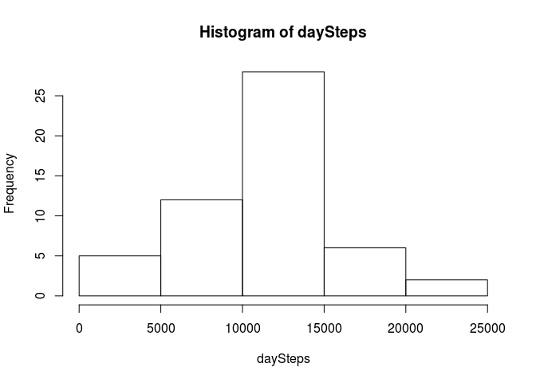
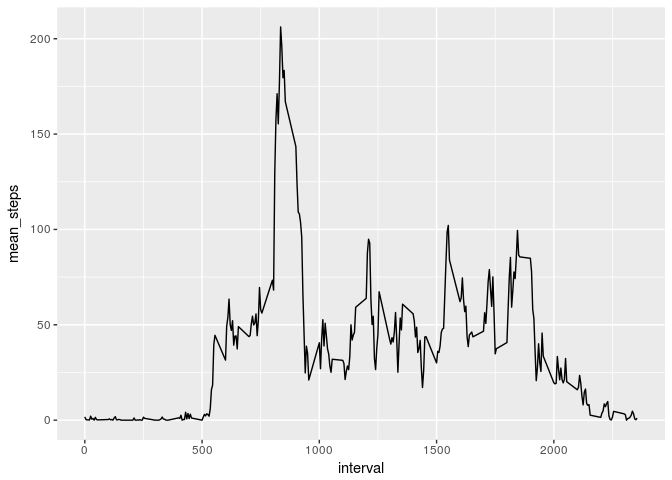
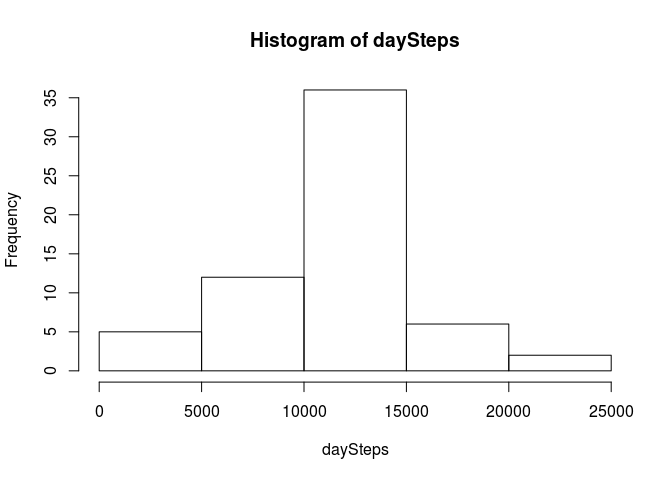
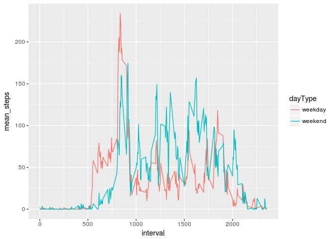

## Loading and preprocessing the data

Load pacakges necessary throughout this assignment

```r
library(ggplot2)
library(lubridate)
```

```
## 
## Attaching package: 'lubridate'
```

```
## The following object is masked from 'package:base':
## 
##     date
```

Load Data:

* unzip
* read
* remove na values


```r
unzip("activity.zip")
rawData <- read.csv(file = "activity.csv")
cleanData <- rawData[!is.na(rawData$steps),]
```


## What is mean total number of steps taken per day?

Split data with zeros removed


```r
daySteps <- tapply(cleanData$steps,cleanData$date,FUN=sum)
```

Create Histogram


```r
hist(daySteps)
```

<!-- -->

Create summary to find mean and median

```r
summ <- summary(daySteps)
```

The mean is 

```r
summ["Mean"]
```

```
##     Mean 
## 10766.19
```

The median is

```r
summ["Median"]
```

```
## Median 
##  10765
```


## What is the average daily activity pattern?
Split data frame by interval and take the mean (update names afterwards)


```r
intervalMeanSteps <- aggregate(cleanData["steps"], by=list(cleanData$interval) , FUN=mean)
names(intervalMeanSteps) <- c("interval","mean_steps")
```

Create plot for mean_steps vs interval


```r
ggplot(data = intervalMeanSteps, aes(interval, mean_steps)) + geom_line()
```

<!-- -->

The "busiest" interval is 

```r
intervalMeanSteps$interval[which.max(intervalMeanSteps$mean_steps)]
```

```
## [1] 835
```


## Imputing missing values

Number of missing values


```r
sum(is.na(rawData$steps))
```

```
## [1] 2304
```

### Strategy
Imputation will be done by using average values over entire dataset for given interval. Using the average of the given day (alternatively suggested in Course website) seems an odd idea given that the missing data seems to only affect entire days. This is confirmed by noting that the number of of non-na values accross all dates with some na values is 0 (naDates variable contains all dates for missing days)


```r
naDates <- levels(droplevels(rawData[is.na(rawData$steps),]$date))
sum(!is.na(rawData[rawData$date %in% naDates,]$steps))
```

```
## [1] 0
```

Impute missing values by replacing each missing day's intervals with the average of the intervals over all days.


```r
imputeData <- rawData
for (d in naDates){
    imputeData[imputeData$date==d,]$steps <- intervalMeanSteps$mean_steps
}
```

Repeat analysis of step 2 for the imputed data set:


```r
daySteps <- tapply(imputeData$steps,imputeData$date,FUN=sum)
```

Create Histogram


```r
hist(daySteps)
```

<!-- -->

Create summary to find mean and median

```r
summ <- summary(daySteps)
```

The mean is 

```r
summ["Mean"]
```

```
##     Mean 
## 10766.19
```

The median is

```r
summ["Median"]
```

```
##   Median 
## 10766.19
```

The mean is unchanged. This is not surprising as the mean number of steps for days with na-data, was replaced with the mean number of steps for each interval. The median is now equal to the Mean. Also not surprising as the imputing drastically increased the number of days whose number of steps is equal to the mean number of steps per day.

## Are there differences in activity patterns between weekdays and weekends?

Working with the imputed data makes no sense as for a given day with na-data, replacing its steps with the average over all days will remove any information about the specific weekday. If one were interested, one would have to impute data for a given day using the mean over only those days with the corresponding weekday.

Add additional factor variable "dayType" indicating whether day is weekend or weekday (note I'm working with a Spanish distribution: saturday = sábado, sunday = domingo)


```r
w <- weekdays(date(cleanData$date))
w[w %in% c("sábado","domingo")] <-  "weekend"
w[w != "weekend"] <-  "weekday"
cleanData$dayType <- as.factor(w)
```

aggregate data to seperate accoding to dayType and interval


```r
intervalMeanSteps <- aggregate(cleanData["steps"], by=list(cleanData$interval,cleanData$dayType) , FUN=mean)
names(intervalMeanSteps) <- c("interval","dayType","mean_steps")
```

Create plots of mean number of steps by interval discrimintated by dayType (weekend or weekday)


```r
ggplot(data = intervalMeanSteps, aes(interval, mean_steps)) + geom_line(aes(colour = dayType))
```

<!-- -->

On weekends people seem to get up later and move around more once awake.
